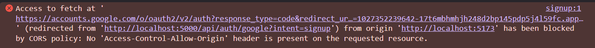
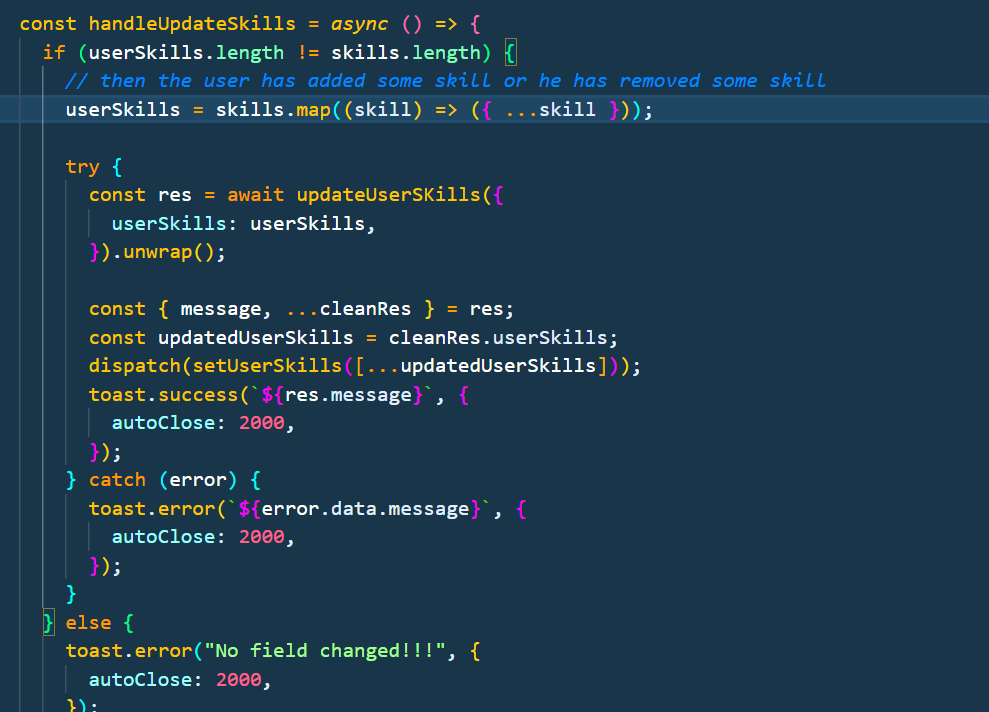
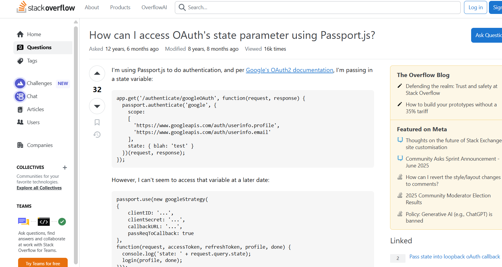
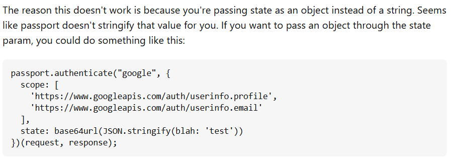
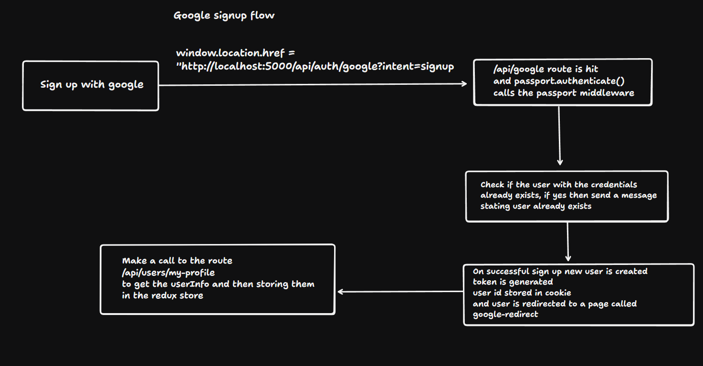
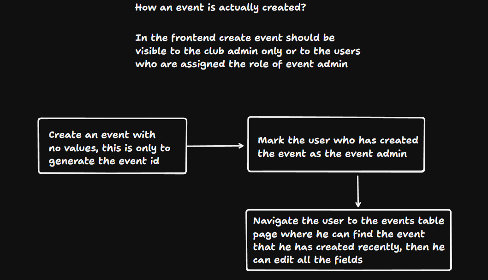

#### Ideation🧠

- How we can make the `skills and proficiency` in the frontend -
  

#### Frontend🥚

In order to persist state in redux we can use a package called as `redux persist`

- When calling register with google from google i was getting this error 


#### Fix to the above problem -

- Understanding the problem
The error message "Access to fetch at 'https://accounts.google.com/o/oauth2/v2/auth...' has been blocked by CORS policy: No 'Access-Control-Allow-Origin' header is present on the requested resource" indicates that your web application running on http://localhost:5173 is trying to make a request directly to Google's OAuth 2.0 authorization endpoint at https://accounts.google.com.

- This is a Cross-Origin Resource Sharing (CORS) error. Google's OAuth 2.0 authorization endpoint does not support direct AJAX/Fetch requests from a different origin due to security reasons. The browser is blocking the request because the response from Google's server does not include the necessary Access-Control-Allow-Origin header that would permit your origin (http://localhost:5173) to access the resource.

- Suggested fix
Instead of directly fetching or using AJAX/Fetch to call Google's OAuth 2.0 authorization endpoint, you need to initiate the authorization flow by redirecting the user's browser to the Google authorization URL. This is the standard and recommended approach for client-side OAuth 2.0 flows.

This can be achieved this by creating a link or a button that, when clicked, sets the window.location.href to the Google authorization URL.

Here's an example using JavaScript:
```js
function handleGoogleSignIn() {
  const authUrl = 'https://accounts.google.com/o/oauth2/v2/auth?' +
                  'response_type=code&' +
                  'redirect_uri=' + encodeURIComponent('http://localhost:5000/api/auth/google?intent=signup') + '&' +
                  'scope=openid%20email%20profile&' + // Add necessary scopes
                  'client_id=YOUR_CLIENT_ID'; // Replace with your actual client ID

  window.location.href = authUrl;
}

// You would then call this function when a user clicks a "Sign in with Google" button, for example:
// <button onclick="handleGoogleSignIn()">Sign in with Google</button>
```
#### While i was making the feature to allow the user to update his skills then i had to check how to detect that the user has actually changed his current skills or not, so earlier i was using this approach -


#### But then i came across the package called `loadash` which can help me do a deep comparison and here is how it works 
```js
import _ from 'lodash';

const changed = !_.isEqual(userSkills, skills);
```

#### Backend🐣

- When the user creates an event then a basic info about the event needs to be uploaded, but that should be saved as a draft, and should only be published when all the necessary details about the event has been added by the event admin

- Before using the admin check and eventadmincheck validate token middleware needs to be called

- Admin can do the same thing as that of event admin like access to deleting one event and more

- It is not necessary that the people who are judges or speakers in an event need to be in our database right, basically they may or may not have an account. If they don't have an account then the user_id in the field will be marked to null

- Using a library like date-fns or moment (though moment is legacy now) can help to deal with dates

`With date-fns:`

```js
import { parse } from "date-fns";

const date = parse("09/08/25", "MM/dd/yy", new Date());
```

- This is how the date is handled -
  

### This is how we can increase the payload size if needed -

The size of req.body in an Express.js app doesn’t have a hard default limit set by Node.js itself — instead, the limit depends on the middleware you’re using to parse the request body, usually express.json() or express.urlencoded().

🔹 Default Limit with Express:

When using:

```js
app.use(express.json());
app.use(express.urlencoded({ extended: true }));
```

`The default limit is 100kb for express.json() and express.urlencoded().`

```js
app.use(express.json({ limit: "5mb" }));
app.use(express.urlencoded({ limit: "5mb", extended: true }));
```

- Flow of event creation -


- Flow of sign up -


- Problems faced when passing state while using passport?


- Soln to the above problem 


- Google sign up flow 


- Event creation flow
