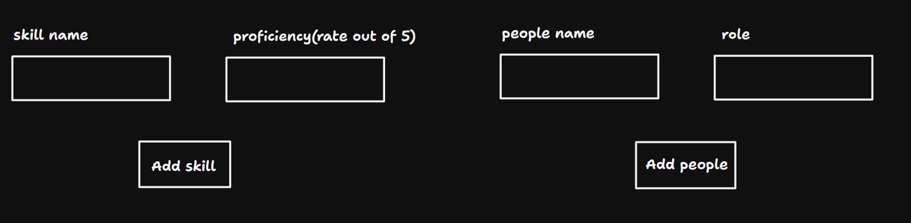
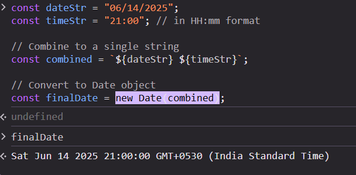
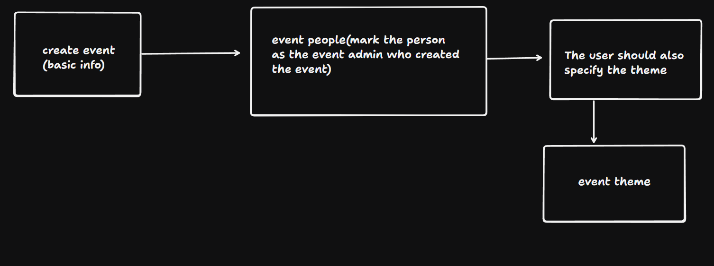

#### Ideation🧠

- How we can make the `skills and proficiency` in the frontend -
  

#### Frontend🥚

In order to persist state in redux we can use a package called as `redux persist`

#### Backend🐣

- When the user creates an event then a basic info about the event needs to be uploaded, but that should be saved as a draft, and should only be published when all the necessary details about the event has been added by the event admin

- Before using the admin check and eventadmincheck validate token middleware needs to be called

- Admin can do the same thing as that of event admin like access to deleting one event and more

- It is not necessary that the people who are judges or speakers in an event need to be in our database right, basically they may or may not have an account. If they don't have an account then the user_id in the field will be marked to null

- Using a library like date-fns or moment (though moment is legacy now) can help to deal with dates

`With date-fns:`

```js
import { parse } from "date-fns";

const date = parse("09/08/25", "MM/dd/yy", new Date());
```

- This is how the date is handled -
  

### This is how we can increase the payload size if needed -

The size of req.body in an Express.js app doesn’t have a hard default limit set by Node.js itself — instead, the limit depends on the middleware you’re using to parse the request body, usually express.json() or express.urlencoded().

🔹 Default Limit with Express:

When using:

```js
app.use(express.json());
app.use(express.urlencoded({ extended: true }));
```

`The default limit is 100kb for express.json() and express.urlencoded().`

```js
app.use(express.json({ limit: "5mb" }));
app.use(express.urlencoded({ limit: "5mb", extended: true }));
```

- Flow of event creation -


- Flow of sign up -
